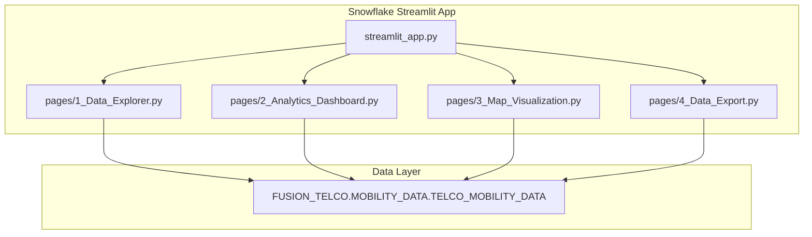

# Plan: Fusion Telco Data Product - Streamlit in Snowflake App

## Overview

Build a multi-page Streamlit in Snowflake (SiS) app that enables monetization of Saudi telco mobility data through:
1. **Data exploration** for prospective buyers
2. **Analytics dashboards** showcasing sellable insights
3. **H3 hexagon maps** for geographic visualization
4. **Data export/purchase** workflow for data product sales

## Architecture



## File Structure

```
/Users/pjose/Documents/GitHub/Fusion_dataset/streamlit_app/
├── streamlit_app.py          # Main entry point with overview
├── pages/
│   ├── 1_Data_Explorer.py    # Browse and filter raw data
│   ├── 2_Analytics_Dashboard.py  # Charts and insights
│   ├── 3_Map_Visualization.py    # PyDeck H3 hexagon map
│   └── 4_Data_Export.py      # Data selection and download
├── environment.yml           # Snowflake Anaconda dependencies
└── README.md                 # Setup and deployment guide
```

## Page Details

### 1. Main Page (streamlit_app.py)
- App branding: "Fusion - Saudi Mobility Intelligence Platform"
- Overview of data product offering
- Key metrics summary (4.2M records, 3 telcos, 31 days)
- Target audience callouts (Retail, Government, Tourism, Transportation)
- Navigation guidance to sub-pages

### 2. Data Explorer (pages/1_Data_Explorer.py)
**Filters (sidebar):**
- City selector (multi-select)
- Date range picker
- Hour of day slider
- Nationality filter
- Age group filter
- Gender filter
- Subscription type filter

**Main content:**
- Filtered record count
- Paginated data table with `st.dataframe`
- Quick stats for current filter selection

### 3. Analytics Dashboard (pages/2_Analytics_Dashboard.py)
**Sellable Insights:**

| Insight | Visualization | Query Pattern |
|---------|---------------|---------------|
| Foot Traffic Trends | Line chart (hourly/daily) | GROUP BY hour/date, COUNT(*) |
| Demographic Breakdown | Bar charts | GROUP BY nationality/age_group/gender |
| Dwell Time Hotspots | Horizontal bar | AVG(avg_staying_duration_min) by city |
| Origin-Destination | Sankey/table | subscriber_home_city distribution |

**Filters:** City, date range (affects all charts)

### 4. Map Visualization (pages/3_Map_Visualization.py)
**Features:**
- PyDeck H3HexagonLayer showing foot traffic density
- Color intensity = record count per hexagon
- Tooltip showing hexagon details
- City center selector to zoom to specific regions
- Time filter to animate hourly patterns

**Technical approach:**
```python
import pydeck as pdk
# H3HexagonLayer for native H3 rendering
layer = pdk.Layer(
    "H3HexagonLayer",
    data=df,
    get_hexagon="HEXAGON_ID",
    get_fill_color="[255, (1-density)*255, 0, 180]",
    ...
)
```

### 5. Data Export/Purchase (pages/4_Data_Export.py)
**Data Product Monetization Flow:**
1. User selects filters (city, date range, demographics)
2. Preview shows sample (first 100 rows)
3. Record count and "data package" summary displayed
4. Download button generates CSV
5. Usage terms/disclaimer shown

**Features:**
- Filter selection matching Data Explorer
- Record count estimate
- Sample preview table
- CSV download via `st.download_button`
- Terms of use acknowledgment checkbox

## Data Access Pattern

All pages will use Snowflake's native connection via `snowflake.snowpark.context`:

```python
from snowflake.snowpark.context import get_active_session

@st.cache_data(ttl=600)
def get_data(filters):
    session = get_active_session()
    query = f"""
        SELECT * FROM FUSION_TELCO.MOBILITY_DATA.TELCO_MOBILITY_DATA
        WHERE 1=1 {build_where_clause(filters)}
        LIMIT 10000
    """
    return session.sql(query).to_pandas()
```

## Dependencies (environment.yml)

```yaml
name: fusion_app
channels:
  - snowflake
dependencies:
  - streamlit
  - snowflake-snowpark-python
  - pandas
  - pydeck
  - h3-py
```

## Deployment

The app will be deployed to Snowflake Streamlit via:
```sql
CREATE STAGE IF NOT EXISTS FUSION_TELCO.MOBILITY_DATA.STREAMLIT_STAGE;
-- Upload files to stage
CREATE STREAMLIT FUSION_TELCO.MOBILITY_DATA.FUSION_APP
  ROOT_LOCATION = '@FUSION_TELCO.MOBILITY_DATA.STREAMLIT_STAGE'
  MAIN_FILE = 'streamlit_app.py'
  QUERY_WAREHOUSE = '<warehouse>';
```

## Key Considerations

1. **Performance**: Use `st.cache_data` with TTL to avoid repeated queries; limit result sets
2. **H3 Rendering**: PyDeck H3HexagonLayer requires valid H3 indexes (already verified in data)
3. **Data Monetization UX**: Clear value proposition on each page; export page acts as "checkout"
4. **SiS Constraints**: No external network calls; all data from Snowflake; Anaconda channel packages only
